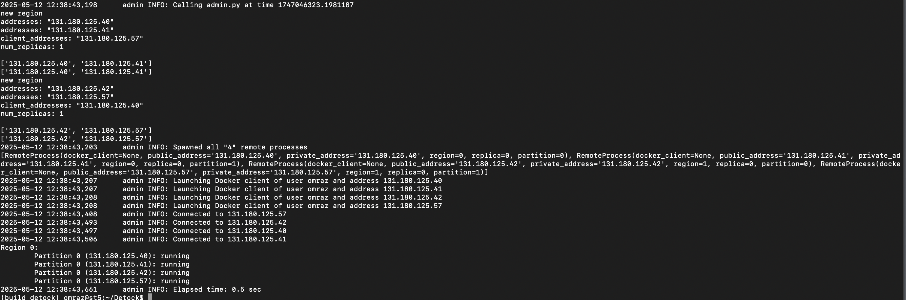

# Running an evaluation scenario using Python scripts

Disclaimer: These instructions have only been tested in an ST cluster setup. For a single computer setup these will have to be adjusted.

## Running a single experiment

Note: If you are running these experiments on the ST machines: ssh into one of them, and run the commands from inside it.

0. If you haven't already done so, create your Python venv `python3.8 -m venv build_detock && source build_detock/bin/activate`, upgrade pip `pip install --upgrade pip` and install the necessary packages `pip install -r tools/requirements.txt`
1. Activate the environment `cd Detock/ && source build_detock/bin/activate`
2. Spin up your cluster.
    1. Make sure your `.conf` file has the correct partitioning. This is different for each DB system that you test.
    2. Make sure you select the correct binary. This is different for some of the DB systems.
    3. Please use the ports assigned to you so your experiments don't interfere with those of other people.
    4. Run the final command. E.g., (for an ST cluster setup) `python3 tools/admin.py start --image omraz/seq_eval:latest examples/ycsb/tu_cluster_ycsb_ddr_ts.conf -u omraz -e GLOG_v=1 --bin slog`
3. Check the status for any errors `python3 tools/admin.py status --image omraz/seq_eval:latest examples/ycsb/tu_cluster_ycsb_ddr_ts.conf -u omraz` Should look something like this: 

4. Run a single experiment. E.g., `python3 tools/admin.py benchmark --image omraz/seq_eval:latest examples/ycsb/tu_cluster_ycsb_ddr_ts.conf -u omraz --txns 2000000 --seed 1 --clients 3000 --duration 60 -wl basic --param "mh=50,mp=50" 2>&1 | tee benchmark_cmd.log`
5. Once you are done with your experiments, stop the cluster. E.g., `python3 tools/admin.py stop --image omraz/seq_eval:latest examples/ycsb/tu_cluster_ycsb_ddr_ts.conf -u omraz`

We will test on the following systems:

1. Detock (standard): Use e.g. `examples/ycsb/tu_cluster_ycsb_ddr_ts.conf`, binary is `slog`
2. Detock (deterministic deadlock resolution only): Use e.g. `examples/ycsb/tu_cluster_ycsb_ddr_only.conf`, binary is `slog`
3. Janus: Use e.g., `examples/ycsb/tu_cluster_ycsb_janus.conf`, binary is `janus`
4. SLOG: Use e.g., `examples/ycsb/tu_cluster_ycsb_slog.conf`, binary is `slog`
5. Calvin: Use e.g., `examples/ycsb/tu_cluster_ycsb_calvin.conf`, binary is `slog`

## Running a whole scenario (with multiple x-values)

1. Spin up the cluster as above if you heaven't already done so.
2. Run a single scenario (you will have to tweak this script to work for your scenario) `python3 tools/run_config_on_remote.py -i [docker_image] -m [machine] -s [scenario] -w [workload] -c [conf_file] -u [username] -db [database_system]` (see file for full list of params). For example, `python3 tools/run_config_on_remote.py -i omraz/seq_eval:latest -m st5 -s baseline -w ycsb -c examples/ycsb/tu_cluster_ycsb_ddr_ts.conf -u omraz -db Detock`
3. Collect results from remote machine. E.g., `scp -r st5:/home/omraz/Detock/data/packet_loss plots/raw_data/ycsb`. Your log files should end up in `plots/raw_data/{workload}/{scenario}`
4. Process the results (you will have to tweak this script to work for your scenario) `python3 plots/extract_exp_results.py -s [scenario] -w [workload]` For example, `python3 plots/extract_exp_results.py -s baseline -w ycsb`

This should produce your plots.

### Latency breakdown

For the latency breakdown plot we use a special data extraction (and plotting) script: `python3 plots/extract_latency_breakdown.py -df [data_folder] -w [output_folder] -of [output_folder]` For example, `python3 plots/extract_exp_results.py -df plots/raw_data/ycsb/lat_breakdown -w ycsb -of plots/data/final/ycsb/latency_breakdown`

## Running all databases for a given scenario

The `tools/run_all_systems_on_remote.py` script will handle the spining up and tearing down of the system after each experiment, so you can run all the databases in a scenario with a single command. Make sure you supply the path to a folder with '.conf' files for all databases.

`python3 tools/run_all_systems_on_remote.py -i [docker_image] -m [machine] -s [scenario] -w [workload] -cf [conf_file_folder] -u [username]`

For example: `python3 tools/run_all_systems_on_remote.py -i omraz/seq_eval:latest -m st5 -s lat_breakdown -w ycsb -cf examples/ycsb/lat_breakdown -u omraz`

## Using tmux

Since the experiments might take some time to run, it is recommended to use a multiplexer such as `tmux`. `tmux` will keep your session alive, even when you lose connection to the remote machine. Any commands (and history) will be saved.

How to use `tmux`:

1. Execute `tmux` in the current directory. Then whatever command you want to execute in the background (i.e. `python3 tools/admin.py ......`).
2. You may now close this window by actually closing the terminal itself, **do not use `Ctrl+C` / `Ctrl+D`**.
3. If at a later point you would like to check in on the experiment, ssh into your machine and execute `tmux attach -t 0` (tmux supports multiple of those "background sessions", so if you have multiple open sessions, you may be looking for an integer larger than `0`).

In general you may want to interact with `tmux` using [keyboard shortcuts](https://gist.github.com/MohamedAlaa/2961058).
